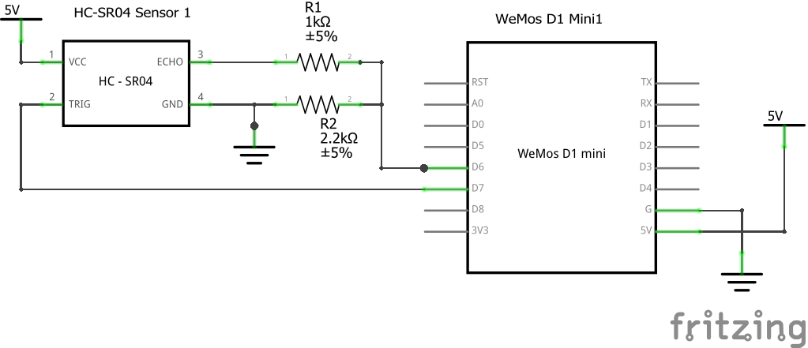
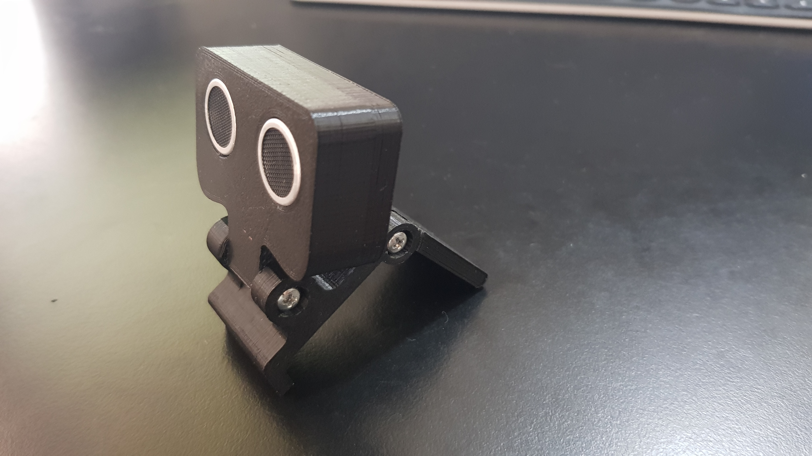

# presence-switch
> this is a work in progress

Using an HC-SR04 with a Wemos Mini D1 to read when an object is present and send a POST request into IFTTT 

Check `arduino/presence-switch/config.example` for settings

STL files can be downloaded from https://www.thingiverse.com/thing:4100737
